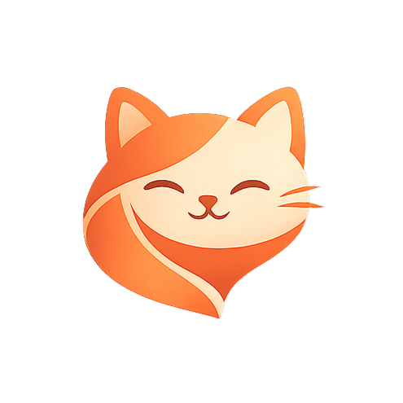
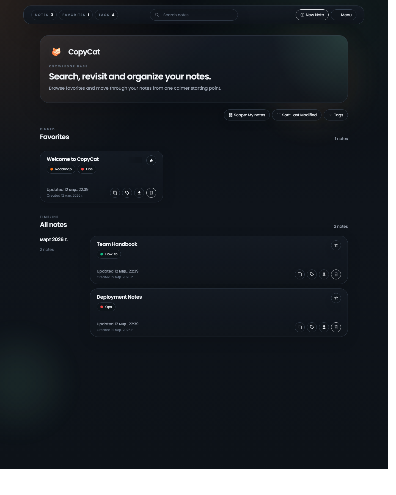
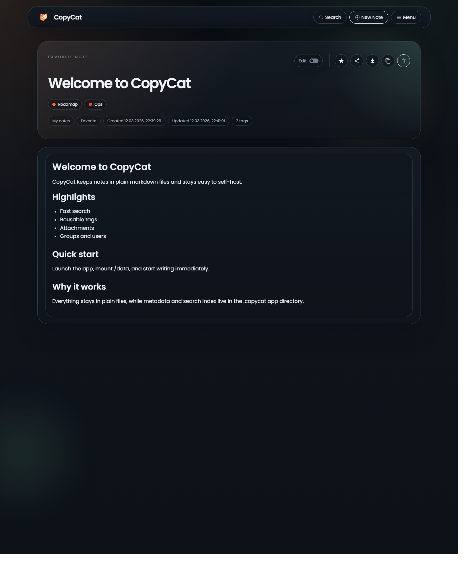
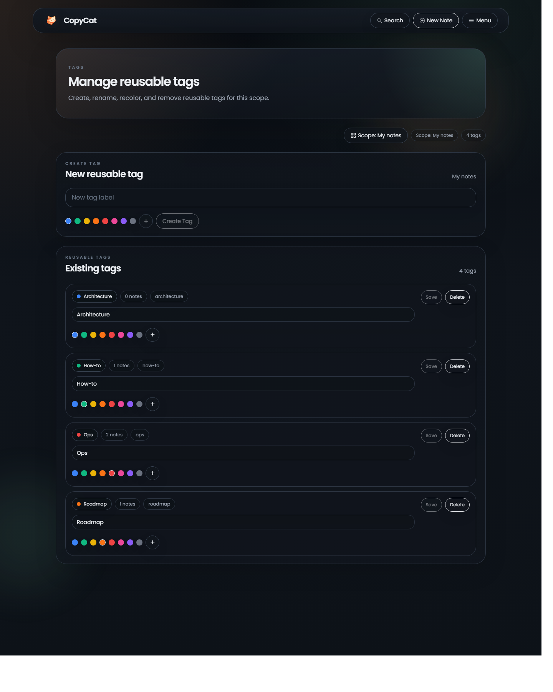
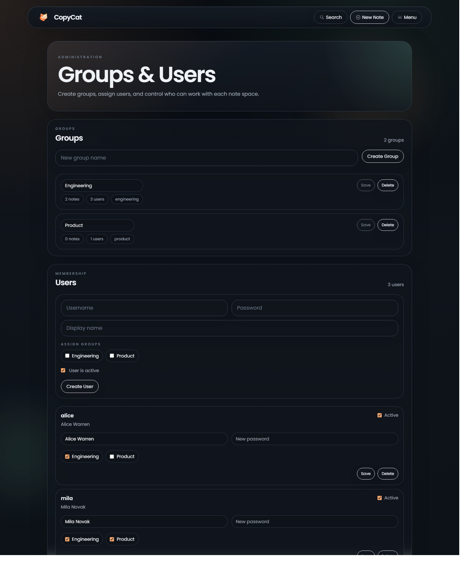

<p align="center">
  
</p>

<h1 align="center">CopyCat</h1>

<p align="center">Self-hosted markdown notes with fast search, tags, attachments, and zero database.</p>

<p align="center">
  <a href="https://www.paypal.com/donate/?hosted_button_id=CGYZPN7LAH8BN">
    
  </a>
</p>

<p align="center">
  
  
  
  
</p>

**CopyCat** is a distraction-free note app for people who want plain markdown files, fast full-text search, and a simple self-hosted setup. Notes stay on disk as regular files, metadata lives in a lightweight hidden app directory, and the search index is rebuildable cache rather than a database.

**Keywords:** self-hosted, markdown, notes, wiki, search, tags, attachments, docker, fastapi, vue

## Screenshots

<p align="center">
  
  
</p>

<p align="center">
  
  
</p>

## Features

- Plain markdown storage
- Fast full-text search
- Custom tags and favorites
- Attachments
- Raw and WYSIWYG editor modes
- Wikilinks like `[[Another Note]]`
- Mobile-friendly UI
- Light and dark themes
- Authentication modes: none, read-only, password, TOTP
- API docs exposed at `/docs`
- Multi-group access model for managed users

## Quick Start

### Build the image

```sh
docker build -t copycat:latest .
```

### Run with Docker

```sh
docker run -d \
  --name copycat \
  -e PUID=1000 \
  -e PGID=1000 \
  -e COPYCAT_AUTH_TYPE=password \
  -e COPYCAT_USERNAME=admin \
  -e COPYCAT_PASSWORD='changeMe!' \
  -e COPYCAT_SECRET_KEY='replace-this-with-a-long-random-secret' \
  -v "$(pwd)/data:/data" \
  -p 8080:8080 \
  copycat:latest
```

Open `http://localhost:8080`.

### Run with Docker Compose

```yaml
services:
  copycat:
    container_name: copycat
    build: .
    image: copycat:latest
    environment:
      PUID: 1000
      PGID: 1000
      COPYCAT_AUTH_TYPE: password
      COPYCAT_USERNAME: admin
      COPYCAT_PASSWORD: changeMe!
      COPYCAT_SECRET_KEY: replace-this-with-a-long-random-secret
    volumes:
      - ./data:/data
    ports:
      - "8080:8080"
    restart: unless-stopped
```

Start it with:

```sh
docker compose up --build -d
```

## Helm Chart

The repository includes a Helm chart at `helm/copycat` for Kubernetes deployments.

What the chart creates:

- `Deployment`
- `Service`
- `PersistentVolumeClaim`
- auth `Secret` or support for an existing Secret
- optional `Ingress`

Important defaults:

- single replica
- `Recreate` deployment strategy
- persistent data mounted at `/data`

These defaults are intentional for a stateful single-volume setup.

### Install with Helm

```sh
helm upgrade --install copycat ./helm/copycat \
  --namespace copycat \
  --create-namespace \
  --set image.repository=your-registry/copycat \
  --set image.tag=latest \
  --set auth.username=admin \
  --set auth.password='changeMe!' \
  --set auth.secretKey='replace-this-with-a-long-random-secret'
```

### Use an existing PVC

```yaml
persistence:
  existingClaim: copycat-data
```

### Use an existing Secret

The existing Secret should expose these keys when `auth.type` is `password` or `totp`:

- `COPYCAT_USERNAME`
- `COPYCAT_PASSWORD`
- `COPYCAT_SECRET_KEY`
- `COPYCAT_TOTP_KEY` for TOTP only

Example:

```yaml
auth:
  type: password
  existingSecret: copycat-auth
```

### Ingress example

```yaml
ingress:
  enabled: true
  className: nginx
  hosts:
    - host: copycat.example.com
      paths:
        - path: /
          pathType: Prefix
```

### Subpath example

If you publish CopyCat under a subpath, set both the ingress path and `pathPrefix`:

```yaml
pathPrefix: /copycat

ingress:
  enabled: true
  className: nginx
  hosts:
    - host: example.com
      paths:
        - path: /copycat
          pathType: Prefix
```

### Upgrade note

If you already have a persistent `/data` volume, the app keeps using the same data. Root metadata is migrated into `/data/.copycat` automatically on startup.

## Configuration

### Core environment variables

| Variable | Required | Default | Purpose |
| --- | --- | --- | --- |
| `COPYCAT_AUTH_TYPE` | No | `password` | Auth mode: `none`, `read_only`, `password`, `totp` |
| `COPYCAT_USERNAME` | Password/TOTP | - | Bootstrap admin username |
| `COPYCAT_PASSWORD` | Password/TOTP | - | Bootstrap admin password |
| `COPYCAT_SECRET_KEY` | Password/TOTP | - | Session signing secret |
| `COPYCAT_TOTP_KEY` | TOTP only | - | TOTP seed for admin login |
| `COPYCAT_PATH` | No | `/data` | Data directory inside the container |
| `COPYCAT_HOST` | No | `0.0.0.0` | Bind address |
| `COPYCAT_PORT` | No | `8080` | HTTP port |
| `PUID` | No | `1000` | Runtime user ID for mounted volumes |
| `PGID` | No | `1000` | Runtime group ID for mounted volumes |

### Useful advanced variables

| Variable | Default | Purpose |
| --- | --- | --- |
| `COPYCAT_PATH_PREFIX` | empty | Serve the app behind a reverse-proxy subpath |
| `COPYCAT_QUICK_ACCESS_HIDE` | `false` | Hide the quick-access block on the home page |
| `COPYCAT_QUICK_ACCESS_TITLE` | `RECENTLY MODIFIED` | Custom home page block title |
| `COPYCAT_QUICK_ACCESS_TERM` | `*` | Custom search term for the home page block |
| `COPYCAT_QUICK_ACCESS_SORT` | `lastModified` | Sort mode for the home page block |
| `COPYCAT_QUICK_ACCESS_LIMIT` | `4` | Number of items in the home page block |
| `COPYCAT_LOGIN_RATE_LIMIT_ENABLED` | `true` | Enable login rate limiting |
| `COPYCAT_LOGIN_RATE_LIMIT_WINDOW_SECONDS` | `60` | Login rate-limit window |
| `COPYCAT_LOGIN_RATE_LIMIT_IP_MAX` | `10` | Max failed attempts per IP |
| `COPYCAT_LOGIN_RATE_LIMIT_USER_IP_MAX` | `5` | Max failed attempts per username and IP |
| `COPYCAT_CSP_MODE` | `report-only` | Content Security Policy mode |
| `COPYCAT_MAX_ATTACHMENT_BYTES` | `26214400` | Max attachment size in bytes |
| `COPYCAT_ATTACHMENT_BLOCK_ACTIVE_CONTENT` | `false` | Block risky attachment types |
| `COPYCAT_ATTACHMENT_BLOCKED_EXTENSIONS` | safe default list | Override blocked file extensions |
| `COPYCAT_SET_HTTPONLY_AUTH_COOKIE` | `false` | Store auth token in an HTTP-only cookie |

## Data Layout

Everything under `/data` persists across container restarts.

```text
/data/
  .copycat/
    auth/
      groups.json
      users.json
    metadata.json
    index/
  attachments/
  groups/
    <group-slug>/
      notes/
      attachments/
      .copycat/
        metadata.json
        index/
```

Notes:

- Bootstrap admin credentials come from environment variables, not from files inside `/data`.
- Managed users and groups are stored inside `/data/.copycat/auth`.
- Favorites, tags, and note metadata are stored in `metadata.json`.
- Search index files are cache and can be rebuilt.
- Older root metadata directories are migrated automatically into `.copycat`.

Useful checks inside the container:

```sh
cd /data
ls -la
ls -la /data/.copycat
ls -la /data/.copycat/auth
cat /data/.copycat/metadata.json
cat /data/.copycat/auth/groups.json
cat /data/.copycat/auth/users.json
ls -la /data/groups/<group-slug>/.copycat
cat /data/groups/<group-slug>/.copycat/metadata.json
```

## Development

### Frontend

```sh
npm install
npm run dev
```

### Production build

```sh
npm run build
```

### Backend

The backend runs with FastAPI and Uvicorn through the container entrypoint. For local container-based development:

```sh
docker compose up --build
```

## Contributing

Issues and pull requests are welcome. Read [CONTRIBUTING.md](CONTRIBUTING.md) before opening a PR.

## Support

If CopyCat saves you time, you can support the project here:

- [Donate with PayPal](https://www.paypal.com/donate/?hosted_button_id=CGYZPN7LAH8BN)
- [paypal.me/YanixLys666](https://paypal.me/YanixLys666)

## License

This project is released under the [MIT License](LICENSE).

## Acknowledgments

- [Whoosh](https://whoosh.readthedocs.io/en/latest/intro.html) for search indexing
- [TOAST UI Editor](https://ui.toast.com/tui-editor) for markdown editing
